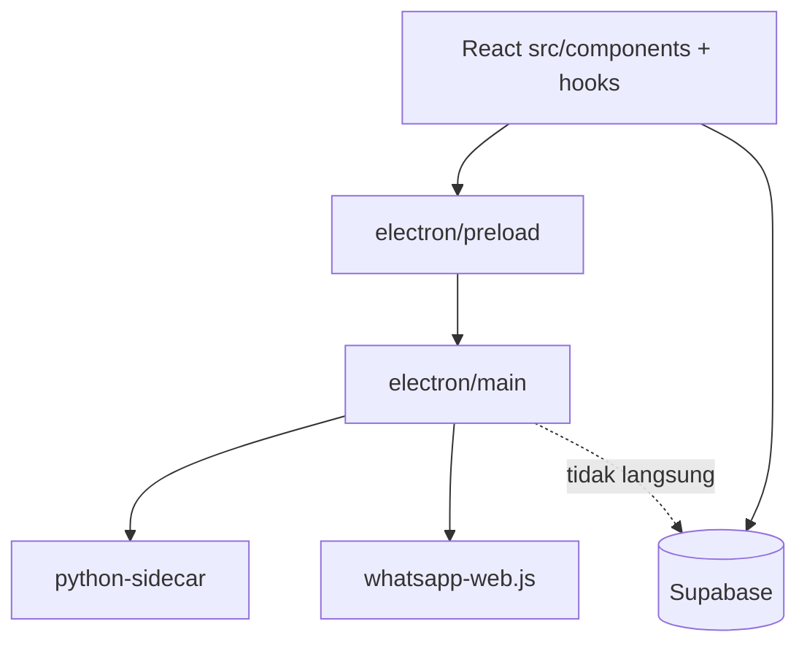

# Audit detail per file — Resource Management

**Tanggal audit:** 2026-05-30  
**Cakupan:** Semua file sumber di repo (excl. `node_modules`, `dist`, `dist-electron`, `release`, `.wwebjs_cache`, `package-lock.json`).  
**Total file diaudit:** ~165 file kode/dokumen (+ cache HTML diabaikan).

**Legenda status**

| Status | Arti |
|--------|------|
| **AKTIF** | Dipakai runtime / build |
| **DEAD** | Tidak di-import; aman dihapus nanti |
| **DEPRECATED** | Masih dipakai sedikit; diganti modul lain |
| **CONFIG** | Konfigurasi / tipe / i18n |
| **DOC** | Panduan operator |
| **SQL** | Migrasi Supabase |
| **TOOL** | Script CLI dev |

**Legenda risiko:** `—` rendah · `T` tinggi · `K` kritis (session/sync)

---

## 0. Ringkasan eksekutif

| Area | File | Baris kode ~ | Temuan utama |
|------|------|--------------|--------------|
| React UI | `src/**` | ~12.5k | Monitoring akun + tiket; data dari Supabase |
| Electron | `electron/**` | ~1.9k | WA `whatsapp-web.js`; TG sidecar HTTP |
| Python | `python-sidecar/**` | ~600 | Login/scrape/validate Telegram |
| SQL | `supabase/migrations/**` | ~950 | **Hanya** 003, 017–020, 023 (+ README) |
| Dead | 0 file | — | Dibersihkan 2026-05-30 |

**Alur bisnis (harusnya):** Login → session di DB → Sync (1 probe) → Scraper → Tiket.  
**Titik panas:** `useAccountSyncFlow.ts` (821 baris), `usePlatformLogin.ts`, `whatsapp.ts`, `telegram_login.py`.

---

## 1. Root & build

| File | Baris | Status | Fungsi | Catatan |
|------|-------|--------|--------|---------|
| `package.json` | 76 | CONFIG | Scripts, deps Electron/React/Supabase | `npm run dev` = Vite+Electron |
| `vite.config.ts` | 74 | CONFIG | Vite + plugin electron | |
| `tsconfig.json` | 24 | CONFIG | TS renderer | |
| `tsconfig.electron.json` | 14 | CONFIG | TS main/preload | |
| `index.html` | 30 | AKTIF | Entry HTML | |
| `.env` / `.env.example` | 18 | CONFIG | Supabase, TG API | Jangan commit secret |
| `README.md` | 70 | DOC | Intro proyek | |
| `JALANKAN_INI.md` | 56 | DOC | Urutan SQL | |
| `SUPABASE_RUNBOOK.md` | 83 | DOC | Verifikasi DB | |
| `AUDIT_DETAIL.md` | — | DOC | File ini | |

---

## 2. Electron — `electron/main/`

| File | Baris | Status | Fungsi | Dipakai oleh | Risiko |
|------|-------|--------|--------|--------------|--------|
| `env.ts` | 4 | AKTIF | Env bootstrap | `index.ts` | — |
| `index.ts` | 79 | AKTIF | Window, register IPC, quit cleanup | Entry main | — |

### `electron/main/platformLogin/`

| File | Baris | Status | Fungsi | IPC / event | Risiko |
|------|-------|--------|--------|-------------|--------|
| `index.ts` | 127 | AKTIF | Router login WA/TG | `platform-login:*` | K |
| `whatsapp.ts` | 501 | AKTIF | Puppeteer WA, QR/phone, LocalAuth | start/cancel/release | K — antrian global WA |
| `telegramSidecar.ts` | 319 | AKTIF | HTTP ke Python :8765, poll QR | QR/ready/phase/error | K |
| `restore.ts` | 63 | AKTIF | `try-restore` IPC | warm session | T |

### `electron/main/scraper/`

| File | Baris | Status | Fungsi | IPC | Risiko |
|------|-------|--------|--------|-----|--------|
| `index.ts` | 92 | AKTIF | Register scraper handlers | `scraper:*` | K |
| `validateSession.ts` | 72 | AKTIF | Probe WA/TG live | validate-session | K |
| `telegramScrape.ts` | 123 | AKTIF | Export string, scrape, restore TG | export/scrape | K |
| `whatsappScrape.ts` | 96 | AKTIF | Scrape grup WA | scraper:run | T |
| `countGroups.ts` | 38 | AKTIF | Route count by platform | count-groups | T |
| `countWhatsApp.ts` | 44 | AKTIF | Hitung grup WA | | T |
| `whatsappGroupFilter.ts` | 10 | AKTIF | Filter grup WA | | — |
| `whatsappParticipants.ts` | 60 | AKTIF | Admin count WA | | — |
| `scrapeProgress.ts` | 21 | AKTIF | Progress IPC ke UI | event progress | — |
| `scrapeOutput.ts` | 20 | AKTIF | Normalisasi output scrape | | — |

### `electron/preload/`

| File | Baris | Status | Fungsi | Catatan |
|------|-------|--------|--------|---------|
| `index.ts` | 135 | AKTIF | `window.electronAPI` bridge | Satu-satunya jembatan renderer↔main |

**IPC lengkap (preload):**

- Login: `start`, `submit`, `cancel`, `release`, `purgeWaAuth`, `tryRestore`, `hasWaDiskAuth`
- Event: `platform-login:qr|pairing-code|phase|ready|error`, `platform-session:invalid`
- Scraper: `run`, `countGroups`, `validateSession`, `exportTelegramSession`, `onProgress`

---

## 3. Python — `python-sidecar/`

| File | Baris | Status | Fungsi | Endpoint utama | Risiko |
|------|-------|--------|--------|----------------|--------|
| `main.py` | 100 | AKTIF | FastAPI app | `/health`, login, scrape, validate | K |
| `telegram_login.py` | 300 | AKTIF | QR/phone/2FA, export session | login/*, export | K — finalize QR setelah `get_me` |
| `telegram_scraper.py` | 207 | AKTIF | Scrape/count/validate | scrape, validate | T |
| `requirements.txt` | — | CONFIG | telethon, fastapi, qrcode | | — |

**Env wajib:** `TELEGRAM_API_ID`, `TELEGRAM_API_HASH` (dari `.env` root).

---

## 4. Supabase — `supabase/migrations/`

| File | Baris | Status | Fungsi | Wajib? |
|------|-------|--------|--------|--------|
| `003_auth_login_rpc.sql` | 17 | SQL | RLS login users | Ya |
| `017_rm_full_reset.sql` | 501 | SQL | 9 tabel RM + RPC dasar + Realtime | DB baru |
| `018_drop_legacy_rm.sql` | 180 | SQL | Drop migrasi lama 001–011 | Sekali (DB lama) |
| `019_realtime_group_scrape_daily.sql` | 13 | SQL | Realtime `group_scrape_daily` | Praktis wajib |
| `020_fix_duplicate_active_sessions.sql` | 14 | SQL | 1 active session / akun | Ya |
| `023_session_and_sync_logs_bundle.sql` | 196 | SQL | Log session/sync + RPC override | Ya |
| `README.md` | 33 | DOC | Urutan resmi | |

**Tidak ada di repo:** `001`–`016`, `021`, `022` (digabung/dihapus). Git status lama mungkin masih menyebut file itu di branch lain.

### Tabel DB ↔ `src/config/tables.ts`

| Konstanta | Tabel Postgres |
|-----------|----------------|
| `brands` | `resource_management_brands` |
| `messagingAccounts` | `resource_management_messaging_accounts` |
| `platformSessions` | `resource_management_platform_sessions` |
| `platformSessionLogs` | `resource_management_platform_session_logs` |
| `syncActivityLogs` | `resource_management_sync_activity_logs` |
| `scrapeRuns` | `resource_management_scrape_runs` |
| `groupScrapeDaily` | `resource_management_group_scrape_daily` |
| `groupsMaster` | `resource_management_groups_master` |
| `accountSnapshots` | `resource_management_account_snapshots` |
| `tickets` | `resource_management_tickets` |

### RPC dipanggil app

| RPC | File pemanggil |
|-----|----------------|
| `rm_save_platform_session` | `platformSessions.ts` |
| `rm_deactivate_platform_sessions` | `platformSessions.ts` |
| `rm_log_session_activity` | `recordSessionActivity.ts` |
| `rm_rebuild_brand_groups_master` | `syncMasterAfterScrape.ts` |

---

## 5. Scripts — `scripts/`

| File | Baris | Status | Fungsi |
|------|-------|--------|--------|
| `setup.ps1` | 13 | TOOL | Install deps Windows |
| `audit-all-accounts.mjs` | 110 | TOOL | Audit akun di DB |
| `diagnose-session.mjs` | 106 | TOOL | Diagnosa session |
| `repair-wa-session.mjs` | 49 | TOOL | Repair baris WA di DB |

---

## 6. Entry & routing — `src/`

| File | Baris | Status | Fungsi |
|------|-------|--------|--------|
| `main.tsx` | 19 | AKTIF | React root, providers auth/i18n |
| `App.tsx` | 28 | AKTIF | Routes: login, monitoring, admin, settings |
| `index.css` | 2293 | AKTIF | Tailwind + tema gelap |
| `vite-env.d.ts` | 149 | CONFIG | Tipe `electronAPI` |
| `env.d.ts` | 8 | CONFIG | Vite env |

### Pages

| File | Baris | Status | Fungsi |
|------|-------|--------|--------|
| `pages/LoginPage.tsx` | 115 | AKTIF | Login Supabase auth |
| `pages/GroupMonitoringPage.tsx` | 37 | AKTIF | Tab Account/Ticket + provider |
| `pages/SettingsPage.tsx` | 28 | AKTIF | Auto-sync + bahasa |
| `pages/AdminPage.tsx` | 71 | AKTIF | Admin (brand/user) |

### Providers & contexts

| File | Baris | Status | Fungsi |
|------|-------|--------|--------|
| `providers/DashboardProviders.tsx` | 35 | AKTIF | Sidebar + tab monitoring |
| `providers/GroupMonitoringProvider.tsx` | 170 | AKTIF | Load groups/tickets, realtime, auto-sync |
| `contexts/AuthContext.tsx` | 29 | AKTIF | User session |
| `contexts/LanguageContext.tsx` | 54 | AKTIF | i18n state |
| `contexts/AutoSyncSettingsContext.tsx` | 79 | AKTIF | Interval auto-sync (default **off**) |
| `contexts/group-monitoring-context.ts` | 30 | AKTIF | Data groups/tickets untuk UI |
| `contexts/auth-context.ts` | 9 | AKTIF | Context type |
| `contexts/language-context.ts` | 9 | AKTIF | Context type |
| `contexts/monitoring-tab-context.ts` | 9 | AKTIF | Tab account/ticket |
| `contexts/sidebar-context.ts` | 6 | AKTIF | Sidebar collapse |

---

## 7. Hooks — `src/hooks/` (semua baris)

| File | Baris | Status | Peran | Risiko |
|------|-------|--------|-------|--------|
| `useAccountSyncFlow.ts` | 821 | AKTIF | Sync manual, scraper, modal login, persist TG/WA | **K** — file terbesar, banyak cabang |
| `usePlatformLogin.ts` | 365 | AKTIF | QR/phone IPC, timeout QR | **K** |
| `useRealtimeAccountSessions.ts` | 129 | AKTIF | Realtime DB session + event logout device | — |
| `useRealtimeMonitoring.ts` | 148 | AKTIF | Realtime snapshots, daily, tickets | T — butuh migrasi 019 |
| `useAutoAccountSync.ts` | 100 | AKTIF | Loop auto-sync semua akun | T — default mati |
| `useAuth.ts` | 9 | AKTIF | Wrapper auth context | — |
| `useGroupMonitoring.ts` | 9 | AKTIF | Wrapper monitoring context | — |
| `useLanguage.ts` | 9 | AKTIF | Wrapper i18n | — |
| `useMonitoringTab.ts` | 9 | AKTIF | Tab + ticket count | — |
| `useSidebar.ts` | 9 | AKTIF | Sidebar | — |
| `useLiveClock.ts` | 15 | AKTIF | Jam header | — |

### Alur sync (setelah penyederhanaan)

```
Logout + Sync → modal login langsung (tanpa PROC SYNC)
Active + Sync → 1× probe 45s → completeSync (assumeSessionValid)
Login sukses → persistLoginSession → completeSync → session-valid modal
```

---

## 8. Lib — `src/lib/` (per file)

| File | Baris | Status | Fungsi singkat | Importer utama |
|------|-------|--------|----------------|----------------|
| `accountBrandUtils.ts` | 148 | AKTIF | Patch grup, metrik, process action | hooks, components |
| `accountDisplayMetrics.ts` | 60 | AKTIF | Build Y/X admin metrics | engine |
| `accountGroupLinks.ts` | 104 | AKTIF | CRUD link grup di DB | GroupLinksModal |
| `accountMonitoringEngine.ts` | 124 | AKTIF | refreshAccountMetrics, probe, count | sync, auto-sync |
| `accountPhone.ts` | 28 | AKTIF | Validasi/update phone | sync flow |
| `accountScrapeData.ts` | 149 | AKTIF | Baca daily scrape | scraper, load |
| `accountScraper.ts` | 240 | AKTIF | Pipeline scrape ke DB | runAccountScraper |
| `accountSessionPatch.ts` | 63 | AKTIF | Patch valid/invalid di groups | realtime |
| `accountSessionResolve.ts` | 126 | AKTIF | Resolve UUID akun DB | sync, persist |
| `accountSessionUi.ts` | 30 | AKTIF | syncResultForInvalidSession | banyak |
| `accountSnapshots.ts` | 99 | AKTIF | Upsert snapshot kartu | provider, sync |
| `accountSyncData.ts` | 239 | AKTIF | fetch daily/master stats | sync flow |
| `assertRmSchema.ts` | 62 | AKTIF | Probe kolom saat load | GroupMonitoringProvider |
| `auth.ts` | 67 | AKTIF | Supabase auth helpers | Login |
| `brands.ts` | 44 | AKTIF | Brand CRUD | Add brand |
| `brandStandardCount.ts` | 123 | AKTIF | Hitung X standar brand | sync |
| `dailyMasterAlignment.ts` | 36 | AKTIF | Align master vs daily | reconcile |
| `dbPhoneSchema.ts` | 6 | AKTIF | Hint migrasi kolom phone | sync modals |
| `deviceSessionId.ts` | 16 | AKTIF | ID Electron = UUID akun (TG) | login, probe |
| `ensureWaSessionInDb.ts` | 46 | AKTIF | Backfill baris WA session | sync |
| `errorMessage.ts` | 15 | AKTIF | Normalisasi error | hooks |
| `exportExcel.ts` | 103 | AKTIF | Export Excel akun | table view |
| `filterAccountGroups.ts` | 74 | AKTIF | Filter slicer akun | provider |
| `filterTicketSummaries.ts` | 49 | AKTIF | Filter tiket | provider |
| `formatLastSync.ts` | 12 | AKTIF | Label waktu sync | cells |
| `groupRowId.ts` | 8 | AKTIF | ID stabil baris grup | scrape |
| `inviteLinkValid.ts` | 14 | AKTIF | Validasi URL invite | links |
| `liveDeviceSession.ts` | 36 | AKTIF | requireLive probe | scraper path |
| `loadAccountMonitoring.ts` | 199 | AKTIF | Hydrate groups dari DB | provider |
| `loadTickets.ts` | 69 | AKTIF | Load tiket open | provider |
| `localeSwitch.ts` | 54 | AKTIF | Persist bahasa | settings |
| `messagingAccounts.ts` | 40 | AKTIF | CRUD akun pesan | add account |
| `monitoringKpis.ts` | 44 | AKTIF | KPI account/ticket | provider |
| `patchAccountMasterInGroups.ts` | 67 | AKTIF | Patch master di state | sync |
| `persistLoginSession.ts` | 88 | AKTIF | Export TG/WA → Supabase | login success |
| `phoneLogin.ts` | 20 | AKTIF | Normalisasi phone login | modal |
| `phoneNormalize.ts` | 10 | AKTIF | Normalisasi digit | phone |
| `platformSessions.ts` | 250 | AKTIF | save/deactivate/load session | inti DB session |
| `platformSessionSync.ts` | 82 | AKTIF | invalidate everywhere | sync gagal |
| `platformSessionLogs.ts` | 76 | AKTIF | Log logout/valid | recordSession |
| `platformSyncCopy.ts` | 135 | AKTIF | Hint teks modal sync | modals |
| `reconcileTickets.ts` | 336 | AKTIF | Tiket dari scrape/master | post-scrape |
| `recordSessionActivity.ts` | 100 | AKTIF | RPC log session | realtime, sync |
| `runAccountCount.ts` | 43 | AKTIF | IPC count groups | engine |
| `runAccountScraper.ts` | 125 | AKTIF | IPC scrape + DB write | sync flow |
| `runAutoSyncAccount.ts` | 203 | AKTIF | Satu akun auto-sync | useAutoAccountSync |
| `scrapeRuns.ts` | 44 | AKTIF | Insert scrape_runs | scraper |
| `sessionAvailability.ts` | 82 | AKTIF | hasUsableLoginSession | sync |
| `sessionProbe.ts` | 37 | AKTIF | IPC validate wrapper | sync, engine |
| `sessionRealtimePolicy.ts` | 18 | AKTIF | Grace 120s pasca-login | sync, realtime |
| `supabase.ts` | 21 | AKTIF | Client Supabase | semua |
| `suppressDevConsoleNoise.ts` | 20 | AKTIF | Filter log dev | main |
| `syncAccountFlow.ts` | 123 | AKTIF | completeSyncAfterLiveSession | sync, login |
| `syncActivityLog.ts` | 72 | AKTIF | Insert sync_activity_logs | sync |
| `syncMasterAfterScrape.ts` | 22 | AKTIF | RPC rebuild master | scraper |
| `ticketExportRows.ts` | 51 | AKTIF | Baris export tiket | ticket UI |
| `ticketGroups.ts` | 75 | AKTIF | Group tiket by brand | ticket body |
| `ticketNote.ts` | 89 | AKTIF | Catatan tiket | ticket modal |
| `ticketTypeLabel.ts` | 35 | AKTIF | Label tipe tiket | i18n helper |
| `utils.ts` | 5 | AKTIF | `cn()` clsx | UI |
| `warmPlatformSession.ts` | 39 | AKTIF | tryRestore IPC | TG login warm |
| `withTimeout.ts` | 27 | AKTIF | Promise timeout | sync probe |

---


## 9. Components — `src/components/`

### Layout & umum

| File | Baris | Status | Fungsi |
|------|-------|--------|--------|
| `layout/DashboardLayout.tsx` | 36 | AKTIF | Shell dashboard |
| `layout/Header.tsx` | 60 | AKTIF | Header + clock |
| `layout/Sidebar.tsx` | 79 | AKTIF | Nav |
| `layout/SidebarLabel.tsx` | 22 | AKTIF | Label nav |
| `layout/SubHeader.tsx` | 39 | AKTIF | Subheader tabs |
| `auth/ProtectedRoute.tsx` | 31 | AKTIF | Guard route |
| `AppDocumentTitle.tsx` | 18 | AKTIF | Title halaman |
| `ErrorBoundary.tsx` | 61 | AKTIF | Error UI |
| `brand/BrandImage.tsx` | 18 | AKTIF | Logo WA/TG |
| `brand/BrandLogo.tsx` | 28 | AKTIF | Logo brand |
| `icons/NavIcons.tsx` | 52 | AKTIF | Ikon sidebar |
| `ui/BrandModalRoot.tsx` | 24 | AKTIF | Backdrop modal |
| `ui/EmptyState.tsx` | 26 | AKTIF | Empty state |
| `ui/KpiCard.tsx` | 25 | AKTIF | Kartu KPI |
| `ui/LiveClock.tsx` | 12 | AKTIF | Jam |
| `ui/MonitoringTabs.tsx` | 52 | AKTIF | Tab Account/Ticket |
| `ui/Panel.tsx` | 133 | AKTIF | Panel layout |
| `settings/LanguageToggle.tsx` | 82 | AKTIF | EN/ZH |
| `settings/AutoSyncSettingsSection.tsx` | 55 | AKTIF | Toggle auto-sync |

### Group monitoring (inti produk)

| File | Baris | Status | Fungsi |
|------|-------|--------|--------|
| `AccountMonitoringBody.tsx` | 86 | AKTIF | Body + sync hook wiring |
| `AccountMonitoringCells.tsx` | 377 | AKTIF | Sel tabel (status, sync, scraper) |
| `AccountMonitoringTableParts.tsx` | 52 | AKTIF | Colgroup/head tabel |
| `AccountBrandCard.tsx` | 202 | AKTIF | Kartu per brand |
| `AccountBrandCardList.tsx` | 87 | AKTIF | List kartu |
| `AccountBrandTableView.tsx` | 81 | AKTIF | Tabel + export |
| `AccountSlicerHeader.tsx` | 147 | AKTIF | Filter slicer |
| `AccountMonitoringSyncModals.tsx` | 147 | AKTIF | Semua modal sync/login |
| `PlatformLoginModal.tsx` | 387 | AKTIF | QR/phone WA/TG |
| `SyncSessionModal.tsx` | 72 | AKTIF | Session valid popup |
| `SyncSuccessModal.tsx` | 63 | AKTIF | Sukses sync |
| `SyncAlertModal.tsx` | 63 | AKTIF | Error alert |
| `SyncScrapeConfirmModal.tsx` | 90 | AKTIF | Konfirmasi scrape |
| `ScrapeProgressModal.tsx` | 46 | AKTIF | Progress scrape |
| `MissingPhoneModal.tsx` | 103 | AKTIF | Input phone wajib |
| `GroupLinksModal.tsx` | 287 | AKTIF | Link grup |
| `AddAccountModal.tsx` | 191 | AKTIF | Tambah akun |
| `AddAccountHeaderMenu.tsx` | 85 | AKTIF | Menu tambah |
| `AddBrandModal.tsx` | 89 | AKTIF | Tambah brand |
| `AddBrandCard.tsx` | 16 | AKTIF | Slot kosong brand |
| `ContentAreaCard.tsx` | 76 | AKTIF | Wrapper konten |
| `KpiGrid.tsx` | 19 | AKTIF | Grid KPI |
| `TicketMonitoringBody.tsx` | 82 | AKTIF | Body tiket |
| `TicketCard.tsx` | 131 | AKTIF | Kartu tiket |
| `TicketSlicerHeader.tsx` | 127 | AKTIF | Filter tiket |
| `TicketIssueDetailModal.tsx` | 126 | AKTIF | Detail isu tiket |

---

## 10. Config & types — `src/config/`, `src/types/`

| File | Baris | Status | Fungsi |
|------|-------|--------|--------|
| `config/tables.ts` | 41 | CONFIG | Nama tabel Supabase |
| `config/dbColumns.ts` | 14 | CONFIG | SELECT kolom |
| `config/masterGroupColumns.ts` | 11 | CONFIG | SELECT master |
| `config/groupScrapeColumns.ts` | 25 | CONFIG | SELECT daily |
| `config/groupLinksTable.ts` | 14 | CONFIG | Kolom link grup |
| `config/groupMonitoringKpis.ts` | 22 | CONFIG | Definisi KPI |
| `config/navigation.ts` | 21 | CONFIG | Route nav |
| `config/autoSyncSettings.ts` | 43 | CONFIG | localStorage auto-sync |
| `config/scraperPolicy.ts` | 6 | CONFIG | Kebijakan scrape |
| `config/scraperOutputSchema.ts` | 24 | CONFIG | Schema output |
| `types/database.ts` | 170 | CONFIG | Tipe DB |
| `types/accountMonitoringUi.ts` | 61 | CONFIG | Tipe UI akun |
| `types/ticketMonitoringUi.ts` | 23 | CONFIG | Tipe UI tiket |
| `types/scrapeProgress.ts` | 9 | CONFIG | Progress scrape |
| `types/monitoring.ts` | 1 | CONFIG | `MonitoringTab` type |

### i18n

| File | Baris | Status |
|------|-------|--------|
| `i18n/index.ts` | 32 | AKTIF |
| `i18n/locales/en.ts` | 388 | AKTIF |
| `i18n/locales/zh.ts` | 377 | AKTIF |

### Assets

| File | Baris | Status |
|------|-------|--------|
| `assets/brand/index.ts` | 23 | AKTIF |
| `assets/brand/manifest.ts` | 14 | AKTIF |

---

## 11. Dead code — dibersihkan (2026-05-30)

| File | Status |
|------|--------|
| `config/accountMonitoringMock.ts` | **Dihapus** |
| `config/ticketMonitoringMock.ts` | **Dihapus** |
| `lib/deviceSessionForAccount.ts` | **Dihapus** |
| `lib/resolveDbAccount.ts` | **Dihapus** — semua import → `accountSessionResolve` |
| `revokePlatformSessionIfNeeded` | **Dihapus** dari `accountMonitoringEngine.ts` |

**Opsional nanti:** pecah `useAccountSyncFlow.ts` (masih ~910 baris) vs `runAutoSyncAccount.ts`.

---

## 12. Risiko terbuka (prioritas)

| ID | Severity | Masalah | File |
|----|----------|---------|------|
| R1 | K | `useAccountSyncFlow` terlalu besar — sulit debug | 821 baris |
| R2 | K | WA global queue — login vs scrape bentrok | `whatsapp.ts` |
| R3 | T | TG sidecar harus hidup + API ID di `.env` | `telegramSidecar`, python |
| R5 | T | Tanpa 019, daily scrape tidak realtime di UI | migrasi |
| R6 | R | StrictMode double-mount bisa ganggu login (dev) | `main.tsx` |

---

## 13. Validasi & checklist

**Dokumen lengkap timeout / anti-deadlock:** [`VALIDATION.md`](VALIDATION.md)

**Otomatis (lulus 2026-05-30):** `npm run typecheck`, `npm run build:web`

**Manual wajib:** lihat §3 di `VALIDATION.md` (TG/WA login, sync, scraper, stabilitas 3 menit).

---

## 14. Diagram dependensi tingkat tinggi



---

*Audit ini mencakup setiap file sumber proyek per baris metadata (path, baris, status, fungsi). Untuk diff baris-per-baris isi kode, gunakan `git diff` atau IDE — tidak disertakan di sini agar dokumen tetap terbaca.*
