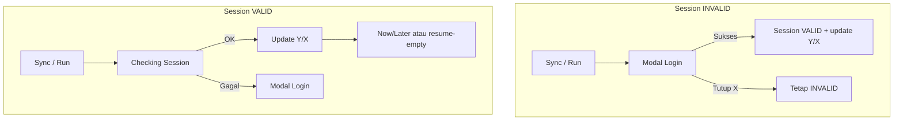
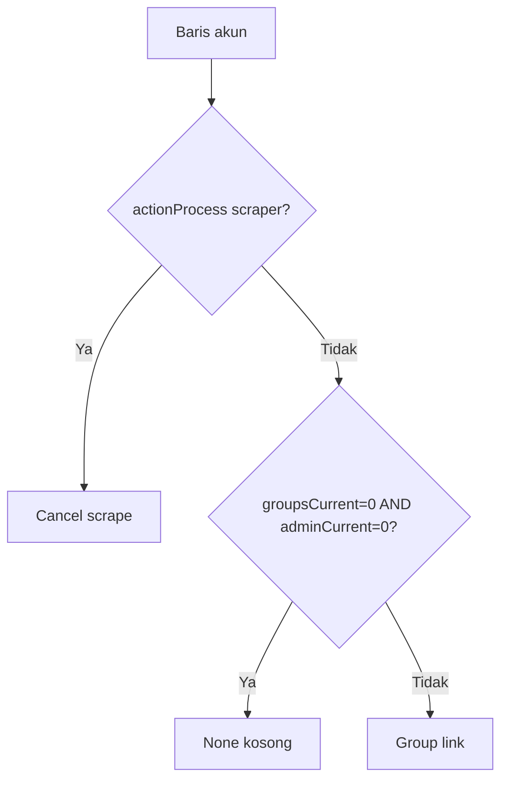

# Resource Management — Referensi Master Proyek

**Versi dokumen:** 2026-06-30  
**Versi aplikasi:** 1.0.30 (`package.json`)  
**Audience:** Developer, QA, dan operator teknis yang perlu memahami UI + logic end-to-end  

## Prinsip dokumen ini

**Dokumen ini BUKAN teks bebas.** Setiap bagian harus bisa ditelusuri ke file di repo. Yang tidak punya file sumber → tidak boleh ditulis.

### Verifikasi otomatis (wajib sebelum percaya doc)

```bash
node scripts/audit-project-master-reference.mjs
# atau: npm run validate:master-reference
```

Script di atas **membaca file di repo** (bukan doc) dan gagal jika drift. Terakhir selaras dengan kode saat audit script lulus.

### Hierarki kebenaran (urutan menang)

1. **Kode + config** (`src/`, `electron/`, `python-sidecar/`, `package.json`)
2. **`logic_sync_scraper.txt`** + **`sessionColumnFlowSpec.ts`** (spec produk)
3. **`docs/PROJECT-MASTER-REFERENCE.md`** (ringkasan — harus mengikuti 1 & 2)
4. **`HANDBOOK.md`**, **`PROJECT.md`**, plan lama — **bisa kedaluwarsa**; jangan jadi acuan tanpa cek kode

### Larangan

- Jangan tulis "direncanakan" / "akan" tanpa file plan aktif yang masih benar.
- Jangan tulis path/API endpoint tanpa buka file implementasinya.
- Jangan gabungkan perilaku yang hanya ada di chat/PR lama tanpa ada di `main`.

Dokumen ini melengkapi (bukan mengganti):

| Dokumen | Isi |
|---------|-----|
| [`PROJECT.md`](../PROJECT.md) | Arsitektur resmi, env, installer, release |
| [`HANDBOOK.md`](./HANDBOOK.md) | Panduan operator (Bahasa Indonesia) |
| [`logic_sync_scraper.txt`](../logic_sync_scraper.txt) | Spec singkat sync/scraper/kolom |
| [`sessionColumnFlowSpec.ts`](../src/lib/sessionColumnFlowSpec.ts) | Matrix routing kolom Session |

---

## Daftar isi

1. [Ringkasan produk](#1-ringkasan-produk)
2. [Navigasi & halaman](#2-navigasi--halaman)
3. [Brand Card & slot akun](#3-brand-card--slot-akun)
4. [Grid 9 kolom — tampilan & data](#4-grid-9-kolom--tampilan--data)
5. [Clear Session](#5-clear-session)
6. [Kolom Action — state machine](#6-kolom-action--state-machine)
7. [Metrik Y/X (Groups & Admin)](#7-metrik-yx-groups--admin)
8. [Alur Sync (tombol ↻)](#8-alur-sync-tombol-)
9. [Alur Scraper / Run](#9-alur-scraper--run)
10. [Cancel Scrape](#10-cancel-scrape)
11. [Modal login platform](#11-modal-login-platform)
12. [Issue KPI (engine in-memory)](#12-issue-kpi-engine-in-memory)
13. [Group matrix (Account header)](#13-group-matrix-account-header)
14. [Realtime & auto-sync](#14-realtime--auto-sync)
15. [Database Supabase](#15-database-supabase)
16. [Electron & sidecar](#16-electron--sidecar)
17. [Hak akses (Admin vs Operator)](#17-hak-akses-admin-vs-operator)
18. [Peta file penting](#18-peta-file-penting)
19. [Validator & script QA](#19-validator--script-qa)

---

## 1. Ringkasan produk

| Nama | Sumber |
|------|--------|
| **Product name (installer / package)** | `Resource Management` — `package.json` → `build.productName` |
| **Brand di sidebar UI** | `Backend Operation` — `src/config/navigation.ts` → `APP_BRAND` |

Aplikasi **desktop Electron** multi-platform untuk memantau dan mengoperasikan banyak akun **WhatsApp** dan **Telegram** per brand.

| Aspek | Detail (verifikasi) |
|-------|---------------------|
| **Platform rilis** | **Windows, macOS, Linux** — `package.json` (`build.win` / `build.mac` / `build.linux`), `scripts/build-installer.mjs`, CI `.github/workflows/release-multiplatform.yml` |
| Windows | NSIS `.exe` — `npm run build:installer:win` |
| macOS | DMG + ZIP — `npm run build:installer:mac` |
| Linux | AppImage — `npm run build:installer:linux` |
| UI | React 19, TypeScript, Vite 6, Tailwind v4 — `package.json` dependencies |
| Database | Supabase PostgreSQL + Realtime — `src/config/tables.ts` |
| WhatsApp | `whatsapp-web.js` + Puppeteer/Chrome — `electron/main/platformLogin/whatsapp.ts` |
| Telegram sidecar | PyInstaller binary: **`rm-telegram-sidecar.exe`** (Win) / **`rm-telegram-sidecar`** (macOS/Linux) — `scripts/lib/cross-platform-artifacts.mjs` → `sidecarBinaryName()` |
| Update app | `electron-updater` — `electron/main/` (auto-update IPC) |

**Prinsip data (kode):**

- Data bisnis (brand, akun, grup, ticket, session flag) → **Supabase** (`src/config/tables.ts`).
- Auth WA on-disk → `{userData}/wa-sessions/` — `electron/main/platformLogin/whatsapp.ts` (`app.getPath('userData')`).
  - Windows contoh: `%APPDATA%\Resource Management\wa-sessions\` — lihat `INSTALL-WINDOWS.md`.
  - Linux/macOS: path `userData` OS masing-masing — lihat `INSTALL-LINUX.md` / `INSTALL-MACOS.md`.

---

## 2. Navigasi & halaman

Routing: `src/App.tsx` (HashRouter)

| Path | Halaman | Akses | Sumber |
|------|---------|-------|--------|
| `/login` | Login app (`loginWithCredentials` → tabel `users`) | Guest | `src/lib/auth.ts`, `src/App.tsx` |
| `/` | Group Monitoring — tab **Account** + **Operations** | Login required | `GroupMonitoringPage.tsx` |
| `/admin` | Admin settings | `AdminRoute` — username `admin` | `AdminRoute.tsx` |
| `/settings` | Redirect → `/admin` jika admin, else `/` | Login required | `SettingsRedirect.tsx` |

**Sync / Run / Cancel:** hanya user dengan `canOperatePlatform` (= role **admin**). Operator **bisa lihat** grid, tombol terkunci (`PermissionLockedButton`). Sumber: `userRole.ts` → `permissionsForRole()`.

**Group Monitoring** — `GroupMonitoringPage.tsx` + `useMonitoringTab()`:

- **Account** — brand card, grid akun, sync/scrape, KPI issue (engine `accountMasterDailyCompare`), **stock chips** + **Group matrix** di header kartu (`AccountBrandStockChips`, `BrandMasterGroupsModal`)
- **Operations** — **Job Queue** saja (stock overview sudah di header Account) — `OperationsMonitoringPanel.tsx`

View mode Account: **Card** (satu kartu per brand) atau **Table** (semua baris flat). State di slicer header.

---

## 3. Brand Card & slot akun

### 3.1 Struktur Brand Card

Satu **Brand Card** = satu brand bisnis (`AccountBrandGroup`).

**Header kartu:**

- Nama brand (expand/collapse)
- Badge jumlah akun WA/TG
- Badge total grup master per platform (klik → modal master groups)
- Badge **All aligned** / **N misaligned** (hanya dari metrik grup+admin, bukan session)
- Menu **+ Add account** (WA atau TG)
- Tombol dismiss brand (admin)

**Body kartu (expanded):** tabel 9 kolom — lihat [§4](#4-grid-9-kolom--tampilan--data).

**File:** `AccountBrandCard.tsx`, `AccountBrandCardList.tsx`, `AccountBrandTableView.tsx`

### 3.2 Slot akun kosong

| Aturan | Nilai / perilaku | Sumber kode |
|--------|------------------|-------------|
| Default slot brand **baru** (tanpa baris DB brand) | **3** slot kosong | `accountBrandUtils.ts` → `DEFAULT_EMPTY_SLOT_COUNT`, `createEmptyBrandGroup()` |
| Brand dari DB | `max(0, brand.empty_slot_count − jumlah akun)` | `loadAccountMonitoring.ts` baris ~200–204 |
| Brand orphan (akun ada, baris brand hilang) | `max(0, 3 − jumlah akun)` | `loadAccountMonitoring.ts` baris ~255 |
| Baris slot kosong | `AccountEmptySlotRow` | `AccountMonitoringCells.tsx` |
| Action slot kosong | Tombol **Add account** | `AccountEmptySlotRow` |
| Tambah akun | Konsumsi 1 slot | `addAccountToGroup()` — `accountBrandUtils.ts` |
| Hapus akun | Kembalikan 1 slot + rebuild master | `removeMessagingAccountFromSlot()` → DELETE akun, purge WA, `rebuildBrandGroupsMaster()` — `messagingAccounts.ts` |

### 3.3 Baris akun vs pending

| `syncState` | Arti |
|-------------|------|
| `pending` | Baris placeholder (akun baru ditambah, belum selesai setup) — banyak kolom `—` |
| `synced` | Akun normal — semua kolom aktif |

---

## 4. Grid 9 kolom — tampilan & data

Definisi kolom: `AccountMonitoringTableParts.tsx` (`ACCOUNT_TABLE_COLUMN_COUNT = 9`)

```
| Account | Brand | Status | Session | Groups | On device | In brand | Admin | Scraper | Action |
```

Lebar default (user-resizable): **Account 20%**, kolom lain **10%** masing-masing — `index.css` + `AccountMonitoringTableColGroup`.

Implementasi sel: `AccountMonitoringCells.tsx`  
Type baris: `AccountBrandRow` di `types/accountMonitoringUi.ts`

### 4.1 Kolom Account

| Elemen | Fungsi |
|--------|--------|
| Badge platform | Icon WA (hijau) atau TG (biru) |
| Account name | Label akun |
| Phone number | Nomor HP / @username; jika kosong → teks merah "No phone" |
| **[↻] Sync** | Memicu alur Sync — `handleSyncAccount` |
| **[X] Remove** | Hover baris — hapus akun dari slot (permission structure) |

### 4.2 Kolom Brand

- Teks `row.brandName` (truncate)

### 4.3 Kolom Status (`row.status`)

| Badge | Kondisi | Sumber |
|-------|---------|--------|
| **Active** (hijau) | `status === 'active'` | `AccountMonitoringCells.tsx` → `StatusBadge` |
| **Logout** (merah) | `status === 'logout'` | idem |

**Set saat load:** `loadAccountMonitoring.ts` → `accountRowFromDb()`:

```ts
const sessionStatus = hasSession ? 'valid' : 'invalid';
const status = sessionStatus === 'valid' ? 'active' : 'logout';
```

`hasSession` = akun ada di set `platform_sessions` aktif (`fetchActiveSessionAccountIdSet`).

Kolom **Session** (VALID/INVALID) terpisah; badge Status mengikuti `sessionStatus` saat hydrate awal.

### 4.4 Kolom Session (`row.sessionStatus`)

| Tampilan | Kondisi |
|----------|---------|
| Badge **VALID** | `sessionStatus === 'valid'` |
| Badge **INVALID** | `sessionStatus === 'invalid'` |
| Marquee **Checking Session on Device** | `actionProcess === 'session_check'` — probe device sedang jalan |
| `—` | Baris `pending` |

**Aturan UX penting (produksi):**

| Situasi | Kolom Session |
|---------|---------------|
| INVALID + Sync/Run → modal login | Tetap badge **INVALID** (bukan Checking Session) |
| VALID + Sync/Run → probe device | **Checking Session** (timeout **20s**, retry busy — `deviceSessionGate.ts`) |
| Device busy (Chrome/scrape lain) | Alert **SESSION_CHECK_BUSY** — **bukan** modal login |
| Resolve session / scrape | **`messaging_accounts.id` baris grid** — `accountSessionResolve.ts`, `accountDbId.ts` |
| Tutup modal login (X / backdrop) | **Tidak berubah** — scan dibatalkan |
| Login sukses | Langsung **VALID** (via `applyResult`) |

Spesifikasi: `sessionColumnFlowSpec.ts`, `useAccountSyncFlow.ts` → `showLoginModal`

**Clear Session (tombol X di kolom Session):**

| Aturan | Detail |
|--------|--------|
| Tampil | Hanya saat `sessionStatus === 'valid'`, hover baris atau kolom Session (`brand-account-row--clearable-session`) |
| Sembunyi | Invalid, pending, `session_check`, sync/scrape berjalan |
| Aksi | `clearAccountSession.ts` → cancel scrape/count → `prepareDeviceForPlatformLogin` (purge WA) → `invalidatePlatformSessionEverywhere` → patch UI Invalid |
| Setelah clear | Sync/Run → routing `open_login` (modal QR bersih, hindari stuck *still starting*) |
| Multi-PC | Invalidate DB → realtime badge Invalid di client lain; purge disk hanya di PC yang menekan X |

File: `clearAccountSession.ts`, `useAccountSyncFlow.ts` → `handleClearSession`, `AccountMonitoringCells.tsx` → `SessionClearButton`

### 4.5 Kolom Groups — format **Y/X**

| Simbol | Field | Arti |
|--------|-------|------|
| **Y** | `groupsCurrent` | Jumlah grup di device / daily scrape hari ini |
| **X** | `groupsTotal` | Standar brand (master count / brand standard) |

Engine: `accountMonitoringEngine.ts`, `accountMasterDailyCompare.ts`, `accountDisplayMetrics.ts`

### 4.6 Kolom On device

| Field | Arti |
|-------|------|
| `groupsCurrent` | Total grup di device / baris daily hari ini (angka tunggal, bukan Y/X) |

### 4.7 Kolom In brand

| Field | Arti |
|-------|------|
| `joinedInMaster` / `groupsTotal` | Format `y/x` — berapa grup master brand yang sudah join di akun ini vs total master (X) |

Sumber: `loadAccountMonitoring.ts`, `accountSyncData.ts`, `mergeMonitoringGroups.ts`

### 4.8 Kolom Admin — format **Y/X** + progress bar

| Simbol | Field | Arti |
|--------|-------|------|
| **Y** | `adminCurrent` | Grup di mana akun ini admin (dari daily/master compare) |
| **X** | `adminTotal` | Denominator standar brand |

Komponen: `AdminProgress` — bar warna (merah / amber / hijau) + label `current/total`

### 4.9 Kolom Scraper

Prioritas tampilan (`ScraperColumnCell`):

| # | Kondisi | Tampilan | Sumber |
|---|---------|----------|--------|
| 1 | `accountNeedsRelogin(row)` → `sessionStatus === 'invalid'` **atau** `status === 'logout'` | *Use Sync (↻) to log in first* | `platformSyncCopy.ts`, `ScraperColumnCell` |
| 2 | `scraperLoading` **atau** `actionProcess === 'scraper'` | Progress bar + marquee | `ScraperColumnCell` |
| 3 | `syncState === 'synced'`, `!isMisaligned`, ada `lastSyncAt` | Timestamp saja | idem |
| 4 | `syncState === 'synced'`, `isMisaligned` | Tombol **Run** + timestamp | idem |
| 5 | `pending` atau belum synced | `—` | idem |

**Misaligned** — `accountSyncUiFlow.ts` → `isRowMisaligned()`:

```ts
result.groupsCurrent !== result.groupsTotal ||
result.adminCurrent !== result.adminTotal
```

Session **tidak** masuk (`logic_sync_scraper.txt`, komentar di `accountSyncUiFlow.ts`).

Progress real-time: IPC `scraper:progress` → `useAccountSyncFlow` → `resolveScrapeBarDisplay`

Spec: `logic_sync_scraper.txt` BAGIAN 2

### 4.10 Kolom Action

Lihat [§6](#6-kolom-action--state-machine) — logic terpusat di `accountActionColumn.ts`

---

## 5. Clear Session

**Tujuan produk:** putus rantai session WA lokal per PC + flag DB, agar operator lain bisa Sync → QR tanpa error restore / manual delete di Supabase.

```
[Hover baris Valid → klik X di Session]
  → cancelActiveDeviceWork (scraper + count)
  → prepareDeviceForPlatformLogin (purgeWaDisk + release Chrome)
  → markPlatformSessionInvalid (reason: user_cleared)
  → logSessionLogoutActivity
  → applyResult → status logout, session invalid (metrik daily tetap)
```

| Platform | Perilaku |
|----------|----------|
| WhatsApp | Hapus folder `wa-sessions/session-{clientId}` di PC ini |
| Telegram | Release sidecar + invalidate string session di DB |

**Bukan** remove slot: `messaging_accounts` dan daily **tetap**.

---

## 6. Kolom Action — state machine

Resolver: `resolveAccountActionColumn(row)` — **prioritas dari atas ke bawah**

| Prioritas | Kind | Tampilan | Kondisi |
|-----------|------|----------|---------|
| 1 | `cancel-scrape` | Tombol **Cancel scrape** | `actionProcess === 'scraper'` |
| 2 | `proc-sync` / `proc-scraper` | **PROC SYNC** / **PROC SCRAPER** | `actionProcess === 'sync'` atau `session_check` |
| 3 | `none` | Kosong | `groupsCurrent === 0` atau `groupsTotal === 0` (0/0, 0/>0) — belum scrape (Y=0) |
| 4 | `group-link` | Tombol **Group link** | `groupsCurrent > 0 && groupsTotal > 0` (>0/>0); session INVALID/VALID sama; bukan patokan admin |

**Slot kosong:** bukan baris akun — tombol **Add account** di `AccountEmptySlotRow`

### 6.1 Group link → modal

1. Klik **Group link**
2. `GroupLinksPickerModal` — pilih mode:
   - **Groups on account** — tabel **7 kolom**: No, Group Name, Group ID, Member Count, Admin Count, Is Admin, Invite Link (`fetchAccountDailyGroupLinks`)
   - **Admin vs master** — bandingkan admin status vs master brand (X)
3. `GroupLinksModal` — tabel + filter + export Excel → `RM-[nama akun]-YYYYMMDD.xlsx`

Data: `accountGroupLinks.ts`, `dedupeScrapeDaily.ts`, `exportExcel.ts`

---

## 7. Metrik Y/X (Groups & Admin)

### 6.1 Definisi

| Metrik | Y (current) | X (total) |
|--------|-------------|-----------|
| Groups | Grup di device / baris daily | Standar brand (master count) |
| Admin | Grup admin untuk akun ini | Standar brand |

### 6.2 Sumber data

| Operasi | Sumber |
|---------|--------|
| Setelah sync valid | sessionOnly UI + DB (`markPlatformSessionSynced`); metrik dari scrape |
| Setelah scrape | `rm_commit_account_scrape` + applyResult grid |
| Setelah scrape | `buildMetricsFromScrapeDaily` dari `group_scrape_daily` |
| Master X | `groups_master` + RPC `rm_account_master_stats` (fallback JS) |
| Dedupe | `dedupeDailyRowsByGroupId`, `dedupeMasterRowsByGroupId` |

### 6.3 Snapshot & header card

- `account_snapshots` — persist snapshot per sync/scrape
- `misalignedCount` di header brand card — jumlah baris akun dengan `isMisaligned === true`

---

## 8. Alur Sync (tombol ↻)

Orchestrator: `useAccountSyncFlow.ts` → `runSyncCheck`  
Routing: `syncFlowService.ts` → `routeFromSessionColumn`

```
sessionStatus === 'invalid'  →  open_login
sessionStatus === 'valid'    →  check_device
```

### 7.1 INVALID + Sync

```
[↻ Sync]
  → cek phone wajib (WA) → modal missing-phone jika kosong
  → executeSyncCheck → kind: 'login'
  → modal PlatformLogin (session badge tetap INVALID)
  → login sukses → persist session UI+DB saja (tanpa device count)
  → modal Now/Later (scrape-prompt) ATAU resume-empty (0 grup daily)
  → Later = sessionOnly UI + markPlatformSessionSynced; Now = scrape device
  → refreshIssues (ticket reconcile)
```

**Tutup modal login:** cancel Chrome + `closeFlow` — session **tetap INVALID**

### 7.2 VALID + Sync

```
[↻ Sync]
  → actionProcess: session_check (Checking Session)
  → backfill session DB jika perlu
  → checkDeviceSessionForValidColumn (Sync light: disk/getState; tanpa cold Chrome)
  → gagal jelas (no disk / unpaired) → invalidate + modal login
  → busy/timeout + session tersimpan → tetap Valid (bukan error Sync)
  → sukses → applyResult sessionOnly (metrik Y/X tetap dari scrape/DB)
  → modal Now/Later ATAU resume-empty
  → Later = session UI+DB saja; Now = scrape device
  → refreshIssues
```

### 7.3 Modal lanjutan sync

| Step | Modal | Kapan |
|------|-------|-------|
| `scrape-prompt` | Now \| Later | Ada data scrapeable (daily hari ini, Y/X grid, atau brand X > 0) |
| `resume-empty` | Info 0 grup | Daily hari ini ada + semua count 0 |
| `sync-error` | Alert error | Gagal sync jarang (auth / desktop); busy≠Logout pada Sync Active |

Now → `runScrapeInBackground({ skipDeviceCheck: true })`
Later → `dismissScrapePrompt` → sessionOnly UI + `markPlatformSessionSynced`

### 7.4 Gate & lock

| Gate | File |
|------|------|
| Desktop only | `electronAPI.isElectron` |
| Satu aksi per akun | `userActionGate.ts` — `tryLockUserAction` |
| Satu scrape global per PC | `scraper:run` → `scrapeRunInFlight` |
| Timeout Sync Active | session light ≤8s (disk/getState); busy → tetap Valid |
| Timeout scrape probe | `sessionCheckTimeoutMs` — `syncScraperPolicy.ts` |

---

## 9. Alur Scraper / Run

Orchestrator: `runScrapeInBackground` (Sync → Scrape Now, login intent scraper, auto-scrape)  
Service: `scrapeFlowService.ts` → `executeScrapeRun`  
Runner: `runAccountScraper.ts` → IPC `scraper:run`

### 8.1 INVALID + Run

```
[Run]
  → resolveScrapeLoginIfNeeded → modal login (intent: scraper)
  → login sukses → auto-scrape TANPA Now/Later
  → writeScrapeDailyRows (RPC rm_commit_account_scrape) → applyResult
```

### 8.2 VALID + Run

```
[Run]
  → session_check (Checking Session) kecuali post-login grace
  → onSessionProbeComplete → actionProcess: scraper
  → bootScrapeUi (progress connect)
  → runAccountScraper → writeScrapeDailyRows (rm_commit atomik) → applyResult
```

Probe gagal meski grid masih VALID → invalidate + modal login.

### 8.3 Scrape Electron (main process)

| Platform | File | Mekanisme |
|----------|------|-----------|
| WhatsApp | `whatsappScrape.ts` | Puppeteer client → list grup → parallel fetch participants (pool 12) |
| Telegram | `telegramScrape.ts` | HTTP POST ke sidecar → loop dialog Telethon |

Cap: `DEVICE_GROUP_TARGET_MAX = 3000` grup  
Progress: `emitScrapeProgress` → renderer  
Write DB: **hanya setelah scrape selesai** — `writeScrapeDailyRows` (cancel sebelum selesai = tidak ada write)

---

## 10. Cancel Scrape

**Trigger UI:** tombol Cancel scrape saat `actionProcess === 'scraper'` (Reading groups — bukan saat `session_check`)

### 10.1 Alur UX

```
[Klik Cancel scrape]
  → modal konfirmasi (Keep running | Cancel scrape)
  → konfirmasi → IPC scraper:cancel
  → scrape loop throw SCRAPER_CANCELLED
  → modal info: "Scrape cancelled. No data was saved."
  → grid tidak berubah; kolom Last update kembali standby
```

### 10.2 Implementasi teknis

| Lapisan | File |
|---------|------|
| UI Action | `accountActionColumn.ts`, `AccountMonitoringCells.tsx` |
| Hook | `useAccountSyncFlow.ts` — `requestCancelScrape`, `confirmCancelScrape` |
| Modal | `ScrapeCancelConfirmModal.tsx`, `SyncAlertModal` (tone neutral) |
| IPC preload | `electronAPI.scraper.cancel` |
| Main flag | `scrapeCancel.ts` — `requestScrapeCancel(sessionId)` |
| WA loop | `whatsappScrape.ts` — cek cancel antar grup |
| TG sidecar | `POST /telegram/scrape/cancel/{session_id}` — flag di loop Python |

---

## 11. Modal login platform

Komponen: `PlatformLoginModal.tsx`  
Hook: `usePlatformLogin.ts`  
Persist: `loginFlowService.ts` → `persistSessionAfterLogin`

### 10.1 Mode login

| Platform | Mode |
|----------|------|
| WhatsApp | QR scan (default), phone pairing, auto-regenerate QR |
| Telegram | QR, phone + code, 2FA |

### 10.2 UX modal (CSS + kode)

| Item | Sumber |
|------|--------|
| Lebar panel min | `src/index.css` → `.platform-login-panel` → `min-width: min(36rem, …)` |
| Kotak QR | `.platform-login-qr-img` / skeleton → `14rem` × `14rem` |
| Tutup = batalkan | `PlatformLoginModal` → `handleDismiss` → `onClose` → `closeFlow` + `platformLogin.cancel` |
| Sync flow skip disk restore | `AccountMonitoringSyncModals.tsx` → `attemptRestore={false}` |

### 10.3 IPC platform login

| Handler | Fungsi |
|---------|--------|
| `platformLogin:start` | Mulai QR / phone |
| `platformLogin:submit` | Code / 2FA |
| `platformLogin:cancel` | Stop Chrome / sidecar |
| `platformLogin:release` | Release browser slot |
| Events | `onQr`, `onReady`, `onError`, `onPhase`, `onPairingCode` |

Main WA: `electron/main/platformLogin/whatsapp.ts`  
Main TG: `electron/main/platformLogin/telegramSidecar.ts` → Python `telegram_login.py`

---

## 12. Issue KPI (engine in-memory)

Tab Ticket DB **dihapus** (rilis 1.0.24 / migrasi 033). Issue hanya KPI di tab Account.

### 12.1 Tipe issue

| Type | Arti |
|------|------|
| `missing_group` | Grup ada di master brand, belum di daily akun |
| `daily_junk_group` | Daily punya group_id tidak ada di master |
| `not_admin` | Seharusnya admin di master, daily bilang bukan |
| `duplicate_group_id` | Duplikat ID |
| `duplicate_group_name` | Duplikat nama |

Session login/logout **bukan** ticket.

### 12.2 Engine (satu sumber kebenaran dengan grid)

```
accountMasterDailyCompare.ts  →  computeAccountTicketBreakdown (in-memory)
buildTicketSummariesFromEngine.ts  →  kartu KPI Issue
```

### 12.3 Kapan grid & matrix refresh

- Setelah sync/scrape sukses → `applyResult` + realtime `group_scrape_daily` → `refreshAccountAfterDailyWrite` → `scheduleMonitoringReload`
- Realtime Supabase pada `group_scrape_daily`, `groups_master`, registry akun
- Hook: `useRealtimeMonitoring.ts`

### 12.4 Data fresh (anti cache lama)

| Langkah | File |
|---------|------|
| Scrape tulis daily + master (RPC atomik) | `accountScraper.ts` → `rm_commit_account_scrape` → `invalidateMasterDailyCacheForScrape` |
| Breakdown Issue | `accountMasterDailyCompare.ts` → `loadMasterDailyForAccount({ forceFresh: true })` |
| Kartu Issue UI | `buildTicketSummariesFromEngine.ts` |
| Patch grid | `patchAccountGridAfterDailyWrite.ts`, `hydrateAccountMetricsFromDaily.ts` |

---

## 13. Group matrix (Account header)

**Read-only** — tidak ubah session, scraper, sync dari modal ini.  
**Entry UI:** badge jumlah grup di header brand card → `BrandMasterGroupsModal` (bukan tab Reporting).

| Komponen | File |
|----------|------|
| Modal + load | `BrandMasterGroupsModal.tsx` → `loadJoinGroupMatrix` |
| Matrix Acc=All | `ReportingJoinMatrixTable.tsx`, `loadJoinGroupReport.ts` |
| Reload realtime | `GroupMonitoringProvider.scheduleReportingReload` → event `rm-reporting-reload` |

**Sumber data:** query Supabase + `dedupeDailyRowsByGroupIdKeepLatest` — bukan cache `masterDailyLoadCache`.

**Filter kolom akun (Yes/No):** jika tidak ada baris, header tabel + dropdown filter tetap tampil; tombol **Back to all groups** reset filter.

---

## 14. Realtime & auto-sync

| Fitur | File |
|-------|------|
| Realtime subscription | `useRealtimeMonitoring.ts` |
| Suspend probe saat sync/scrape | `AccountMonitoringBody.tsx` → `probeSuspendAccountIds` |
| Auto sync background | `useAutoAccountSync.ts` (admin only, `canAutoSync`) |
| Session grace setelah login | `sessionRealtimePolicy.ts` — skip probe berulang |

---

## 15. Database Supabase

Sumber nama: `src/config/tables.ts`

| Konstanta | Tabel |
|-----------|-------|
| `users` | `users` |
| `brands` | `resource_management_brands` |
| `messagingAccounts` | `resource_management_messaging_accounts` |
| `platformSessions` | `resource_management_platform_sessions` |
| `platformSessionLogs` | `resource_management_platform_session_logs` |
| `syncActivityLogs` | `resource_management_sync_activity_logs` |
| `scrapeRuns` | `resource_management_scrape_runs` |
| `groupScrapeDaily` | `resource_management_group_scrape_daily` |
| `groupsMaster` | `resource_management_groups_master` |
| `accountSnapshots` | `resource_management_account_snapshots` |
| `tickets` | `resource_management_tickets` |
| `ticketIssueHandles` | `resource_management_ticket_issue_handles` |

**Realtime publication:** `RM_REALTIME_TABLES` (migration 017)

---

## 16. Electron & sidecar

### 14.1 Bootstrap

`electron/main/index.ts` → register IPC:

- `registerAppIpc` — config, auto-update
- `registerPlatformLoginIpc` — WA/TG login
- `registerScraperIpc` — scrape, count, validate, cancel

### 14.2 Preload bridge

`electron/preload/index.ts` → `window.electronAPI`:

- `app.*`
- `platformLogin.*`
- `scraper.*` (run, cancel, countGroups, validateSession, onProgress)
- `onSessionInvalid`

### 14.3 Python sidecar (Telegram)

Host/port: `127.0.0.1:8765` — `electron/main/platformLogin/telegramSidecar.ts`, `python-sidecar/main.py` (`uvicorn.run`).

Endpoint **aktual** (`python-sidecar/main.py`):

| Method | Path | Fungsi |
|--------|------|--------|
| GET | `/health` | Health check |
| POST | `/telegram/login/qr/start` | Body `{ sessionId }` — start QR |
| POST | `/telegram/login/phone/start` | Body `{ sessionId, phone }` |
| POST | `/telegram/login/code` | Submit OTP |
| POST | `/telegram/login/2fa` | Submit 2FA |
| GET | `/telegram/login/status/{session_id}` | Status login |
| POST | `/telegram/login/cancel/{session_id}` | Cancel login |
| POST | `/telegram/login/start` | Alias → qr/start |
| POST | `/telegram/scrape/{session_id}` | Full scrape |
| POST | `/telegram/scrape/cancel/{session_id}` | Cancel scrape |
| GET | `/telegram/scrape/progress/{session_id}` | Progress poll |
| POST | `/telegram/validate/{session_id}` | Validate session |
| GET | `/telegram/session/export/{session_id}` | Export session string |
| POST | `/telegram/session/restore` | Restore session string |

Build sidecar: `npm run build:sidecar` → `resources/sidecar/` + nama dari `sidecarBinaryName()` (`cross-platform-artifacts.mjs`).

### 14.4 Skala performa (akun besar ~3000 grup)

`syncScraperPolicy.ts` + `deviceGroupScale.ts`:

- Timeout QR / scan / confirming diskalakan per estimasi grup
- Sync Active / Later: session light saja — tanpa count/merge group_id di renderer
- Scrape Now: `rm_commit_account_scrape` atomik + idle watchdog

---

## 17. Hak akses (Admin vs Operator)

Model: `src/lib/userRole.ts` — role dari **username login**, bukan kolom `users.role` DB.

| Username | Role app | Sumber |
|----------|----------|--------|
| `admin` (case-insensitive) | Admin | `ADMIN_USERNAME`, `resolveAppRoleFromUsername()` |
| Selain `admin` | Operator | idem |

| Permission | Admin | Operator | Sumber |
|------------|-------|----------|--------|
| `canManageStructure` | ✓ | ✗ | `permissionsForRole()` |
| `canOperatePlatform` | ✓ | ✗ | idem |
| `canAutoSync` | ✓ | ✗ | idem |
| `canAdminSettings` | ✓ | ✗ | idem |

**Data workspace operator:** `monitoringDataUser.ts` → `resolveMonitoringUserId()` — operator load data `user_id` akun username `admin` di tabel `users`; jika admin tidak ditemukan, fallback `loggedInUserId`.

UI lock: `PermissionLockedButton` di sel terkunci.

---

## 18. Peta file penting

### UI Group Monitoring

| File | Peran |
|------|-------|
| `AccountMonitoringBody.tsx` | Body tab Account + provider wiring |
| `AccountMonitoringCells.tsx` | Semua sel kolom grid |
| `AccountMonitoringSyncModals.tsx` | Semua modal sync/login/cancel |
| `PlatformLoginModal.tsx` | Modal QR/phone login |
| `GroupLinksModal.tsx` | Modal group link |
| `ScrapeCancelConfirmModal.tsx` | Konfirmasi cancel scrape |
| `BrandMasterGroupsModal.tsx` | Group matrix dari header Account — Full Group / Full Admin |
| `ReportingJoinMatrixTable.tsx` | Matrix join/admin + filter kolom |
| `OperationsMonitoringPanel.tsx` | Tab Operations — Job Queue saja |
| `AccountBrandStockChips.tsx` | Chip stock di header Account brand card |
| `OperationsJobQueueAddBar.tsx` | Enqueue task + SETUP modal trigger |
| `OperationsJobQueueSetupModal.tsx` | SETUP create/join/set_admin/exit |
| `OperationsJobQueueCreateGroupViewModal.tsx` | VIEW create result + Set Photo tab |
| `createSetPhotoFlow.ts` | Set photo queue block + tab lock + remark keys |
| `createGroupWorkerSettings.ts` | Create group defaults + enqueue dari modal draft |
| `classifyGroupStock.ts` | Decision table stock bucket |
| `loadOperationsStockCounts.ts` | Load + agregat stock dari master |
| `loadJoinGroupReport.ts` | Fetch matrix/daily reporting |
| `masterDailyLoadCache.ts` | Cache warm load awal; **invalidate** setelah scrape |
| `accountSessionResolve.ts` | Resolve UUID akun per baris grid |
| `accountDbId.ts` | Normalisasi `messaging_accounts.id` |
| `deviceSessionGate.ts` | Probe session 20s + retry busy |

### Hooks & state

| File | Peran |
|------|-------|
| `useAccountSyncFlow.ts` | **Orchestrator utama** sync + scrape + cancel |
| `usePlatformLogin.ts` | State modal login + IPC listeners |
| `useGroupMonitoring.ts` | Filter, groups state, refresh |
| `useRealtimeMonitoring.ts` | Supabase realtime + reconcile |

### Services & lib (business logic)

| File | Peran |
|------|-------|
| `syncFlowService.ts` | Routing INVALID/VALID, probe, sync payload |
| `scrapeFlowService.ts` | Scrape execute + session probe |
| `loginFlowService.ts` | Post-login metrics + modal step |
| `runAccountScraper.ts` | IPC scrape + write daily |
| `loadAccountMonitoring.ts` | Hydrate awal dari Supabase |
| `accountBrandUtils.ts` | Slot CRUD, apply sync result |
| `accountActionColumn.ts` | Logic kolom Action |
| `sessionColumnFlowSpec.ts` | Spec matrix session column |
| `accountMasterDailyCompare.ts` | Engine Y/X + ticket breakdown (in-memory) |
| `buildTicketSummariesFromEngine.ts` | Kartu Issue dari engine |
| `clearAccountSession.ts` | Clear Session — purge lokal + invalidate DB |
| `messagingAccounts.ts` | Remove slot + rebuild master |

### Electron main

| File | Peran |
|------|-------|
| `platformLogin/whatsapp.ts` | WA login + Puppeteer |
| `platformLogin/telegramSidecar.ts` | Client HTTP ke Python |
| `scraper/index.ts` | IPC scrape + cancel |
| `scraper/whatsappScrape.ts` | WA scrape loop |
| `scraper/telegramScrape.ts` | TG scrape client |
| `scraper/scrapeCancel.ts` | Flag cancel per sessionId |

### Spec & docs

| File | Peran |
|------|-------|
| `logic_sync_scraper.txt` | Spec produk singkat |
| `docs/OPERATIONS-STOCK-ENGINE.md` | Kontrak klasifikasi stock Operations |
| `docs/HANDBOOK.md` | Panduan operator |
| `docs/PROJECT-MASTER-REFERENCE.md` | **Dokumen ini** |

---

## 19. Validator & script QA

**Audit doc ini:**

```bash
npm run validate:master-reference
```

Jalankan sebelum release: `npm run validate:pre-release`

| Script | Fokus |
|--------|-------|
| `validate:master-reference` | **Fakta doc vs repo** (`audit-project-master-reference.mjs`) |
| `validate:sync-scraper-spec` | Spec vs implementasi sync/scraper |
| `validate:session-flow` | Routing kolom session + `validate-clear-session` |
| `validate:account-slot-lifecycle` | Remove slot + rebuild master + purge WA |
| `validate:account-slot-lifecycle` | Slot min 3, add/remove |
| `validate:wa-qr-login` | Timeout QR WA, modal close |
| `validate:telegram-login` | Alur login TG |
| `validate:multi-account-wa` | Multi-akun WA |
| `validate:reporting-matrix` | Group matrix + filter back (`validate-reporting-matrix.mjs`) |
| `validate:operations-stock` | Decision table stock + wire Account stock chips |
| `validate:operations-job-queue` | Job Queue actions + concurrency |
| `validate:real-operations-data` | Data device nyata (bukan mock) |
| `validate:device-group-scale` | Skala hingga 6000 grup |
| `validate:post-login-sync` | Sync setelah login |
| `validate:desktop` | Gabungan validator desktop |

---

## Diagram alur ringkas

### Sync vs Session column



### Kolom Action



---

## Changelog dokumen

| Tanggal | Perubahan |
|---------|-----------|
| 2026-06-06 | Dokumen master awal |
| 2026-06-06 | Audit script `validate:master-reference`; perbaiki endpoint sidecar; hierarki kebenaran; hak akses Sync admin-only |
| 2026-06-11 | Grid 9 kolom (On device, In brand); Clear Session; remove slot rebuild master; group link 7 kolom |

---

*Jangan percaya doc manual. Jalankan `npm run validate:master-reference` — gagal berarti doc atau kode drift.*
